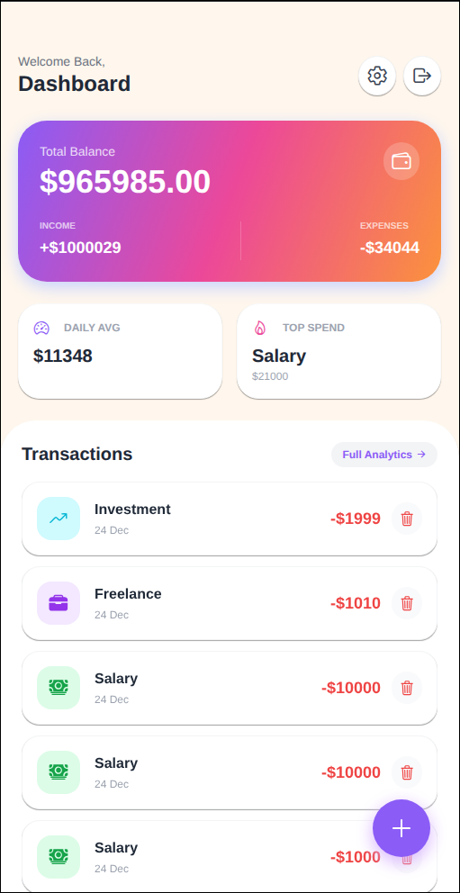
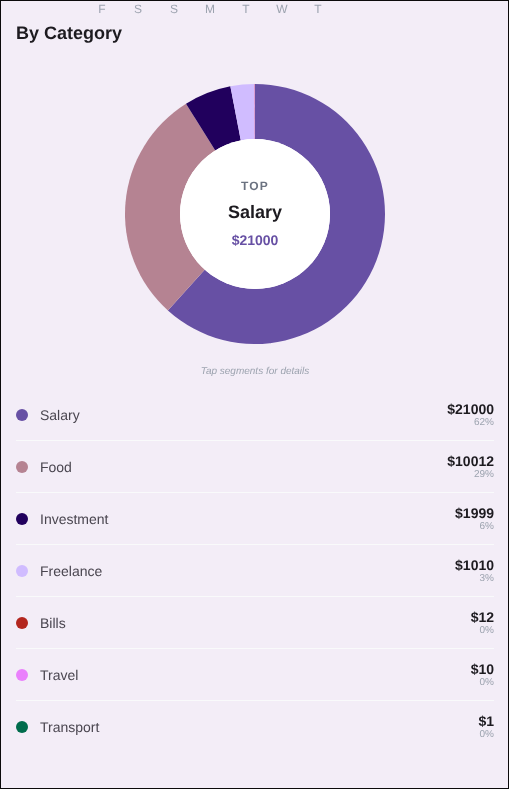
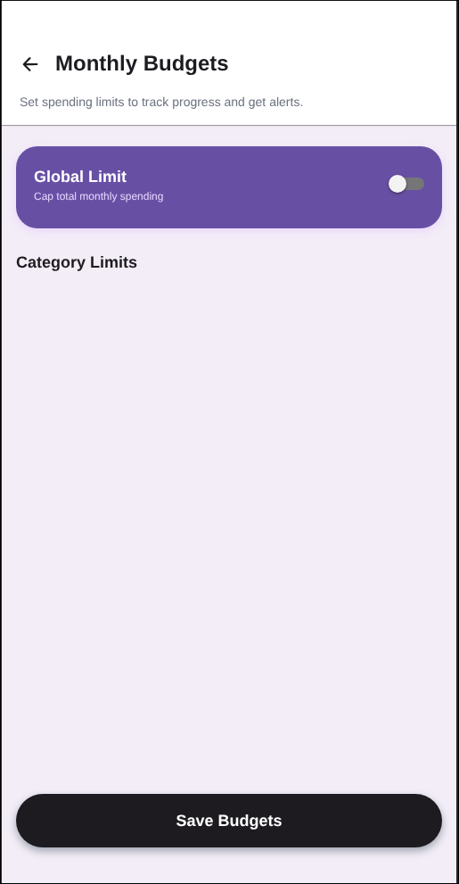
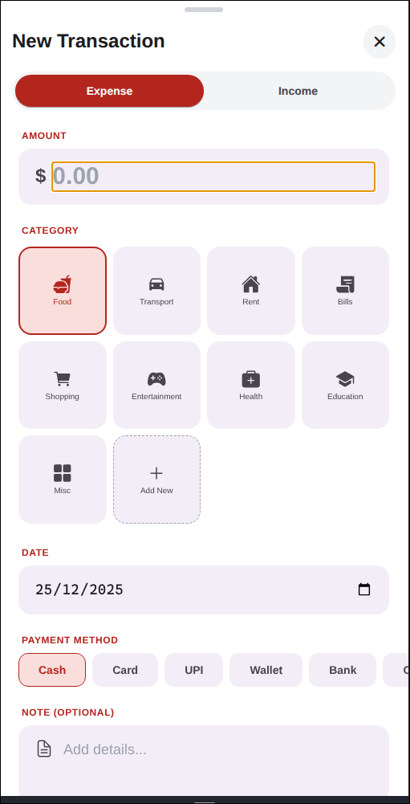
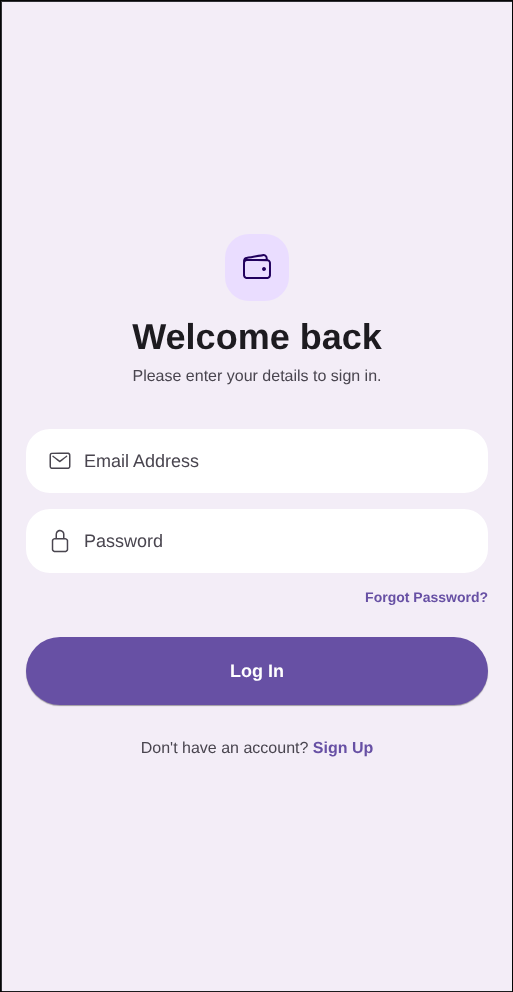

# 💰 Pocket Expense

**Pocket Expense** is a sophisticated personal finance tracker designed to help users achieve financial clarity. Built with an "Android-First" philosophy, it combines a high-performance **React Native** interface with a secure **Node.js** backend to deliver real-time expense tracking, intelligent budgeting, and actionable insights.

---

## 📱 App Showcase

<div style="display: flex; flex-wrap: wrap; gap: 10px; justify-content: center;">
  
  
  
  
  
</div>

> *Screenshots demonstrating the Dashboard, Analytics, Budgeting Interface, and Transaction Entry flow.*

---

## 🏗️ Technical Architecture

This project is architected for scalability and performance, utilizing a modern **MERN** (MongoDB, Express, React Native, Node) stack.

### **Frontend: Mobile Application**
*   **Framework**: **React Native** (Expo SDK 50+) for cross-platform native rendering.
*   **State Management**: **Redux Toolkit** handles global state (User Session, Expense Data, Budget Limits) with Thunks for asynchronous API calls.
*   **UI System**: **NativeWind (Tailwind CSS)** provides a utility-first styling approach, ensuring a consistent design system across all screens.
*   **Visualizations**: **React Native Gifted Charts** renders high-performance animated Pie and Bar charts for analytics.
*   **Persistence**: **AsyncStorage** implements a robust caching layer, enabling the app to function fully offline and sync data when connectivity restores.

### **Backend: REST API**
*   **Runtime**: **Node.js** with **Express.js** provides a lightweight, focused API layer.
*   **Database**: **MongoDB Atlas** stores complex relational data (Users -> Expenses -> Categories) using **Mongoose** for schema validation.
*   **Security**: **JWT (JSON Web Tokens)** ensures stateless, secure authentication for every protected endpoint.
*   **Middleware**: Custom middleware handles Request Logging, Error Standardization, and Token Verification.

---

## ✨ Key Features & Capabilities

### **1. Real-Time Dashboard & Analytics**
*   **Live Metrics**: The dashboard instantly aggregates total balance, income vs. expenses, and daily spending averages.
*   **Interactive Insights**: Users can explore their spending habits through animated visualizations:
    *   **Pie Breakdown**: Categorizes spending (e.g., 40% Food, 20% Transport).
    *   **Weekly Trends**: Bar charts visualize spending patterns over the last 7 days.
*   **Smart Feedback**: The UI uses **Haptic Feedback** and **Entry Animations** to create a tactile, responsive user experience.

### **2. Intelligent Budgeting System**
*   **Custom Limits**: Users can define strict monthly budgets for specific categories (e.g., Shopping, Bills).
*   **Proactive Notification Engine**:
    *   **⚠️ Soft Warning**: Triggered at **80%** budget utilization to encourage caution.
    *   **🚨 Critical Alert**: Triggered immediately when a budget is **exceeded (100%)**.
*   **Global Cap**: Option to set an overall monthly spending limit for holistic financial control.

### **3. Robust Transaction Lifecycle**
*   **Frictionless Entry**: A streamlined "Bottom Sheet" style modal allows for rapid transaction entry with fewer taps.
*   **Offline-First Strategy**: 
    *   Expenses added offline are flagged and queued locally.
    *   A background sync mechanism pushes these records to the server automatically when the network becomes available.
*   **CRUD Operations**: Full capability to Edit historical records or Delete accidental entries, updating all related analytics instantly.

---

## 🔌 API Reference

The backend exposes a comprehensive RESTful API. All protected routes require a valid `x-auth-token` header.

| Domain | Method | Endpoint | Description | Payload Example |
| :--- | :--- | :--- | :--- | :--- |
| **Auth** | `POST` | `/api/auth/register` | Register User | `{ "name": "...", "email": "...", "password": "..." }` |
| | `POST` | `/api/auth/login` | Login | `{ "email": "...", "password": "..." }` |
| **Expenses** | `GET` | `/api/expenses` | Fetch History | - |
| | `POST` | `/api/expenses` | Add Transaction | `{ "amount": 50, "category": "Food", "type": "expense" }` |
| | `PUT` | `/api/expenses/:id` | Update Transaction | `{ "amount": 55 }` |
| | `DELETE` | `/api/expenses/:id`| Remove Transaction | - |
| **Budgets** | `GET` | `/api/budgets` | Fetch Limits | - |
| | `POST` | `/api/budgets` | Set Budget | `{ "category": "Food", "limit": 500 }` |

---

## 📂 Project Structure

The codebase is organized to promote modularity and testability:

```
pocket_expense/
├── src/
│   ├── components/     # Reusable UI (GradientCards, InputFields)
│   ├── screens/        # Feature Views (Dashboard, Insights, Budget)
│   ├── navigation/     # App Navigation & Deep Linking logic
│   ├── store/          # Redux Slices (State Logic) & Async Thunks
│   ├── utils/          # Helpers (Notification Manager, Date Formatters)
│   └── config.js       # Environment-aware Configuration
│
└── server/
    ├── models/         # Mongoose Schemas & Data Validation
    ├── routes/         # API Endpoint Definitions
    ├── middleware/     # Auth Guards & Error Handling
    └── config/         # Database Connection Logic
```

---

## 🚀 Setup & Installation

1.  **Backend Initialization**:
    ```bash
    cd server
    npm install
    # Create .env file with: MONGO_URI, JWT_SECRET, PORT
    npm run dev
    ```

2.  **Frontend Initialization**:
    ```bash
    npm install
    # Ensure src/config.js points to your local IP or localhost
    npx expo start -c
    ```

---

**Developed by Kalon**
_Demonstrating proficiency in Full-Stack Mobile Development._
